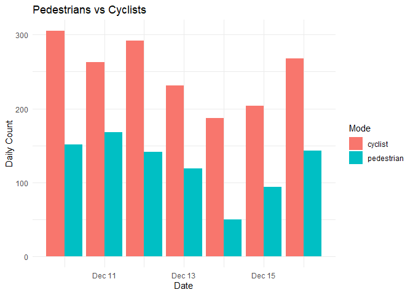
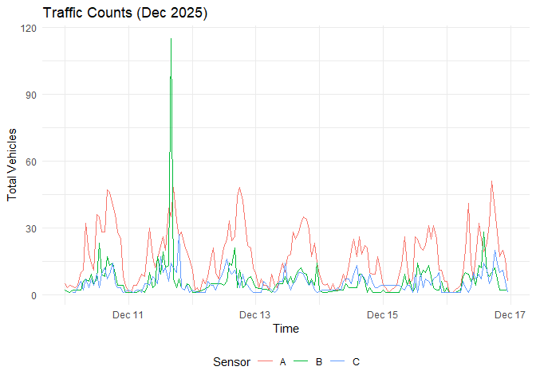

<!-- README.md is generated from README.Rmd. Please edit that file -->

# vivrcity

<!-- badges: start -->

<!-- badges: end -->

The goal of vivrcity is to provide a simple R interface to the [Vivacity
Labs API](https://docs.vivacitylabs.com/).

## Installation

You can install the development version of vivrcity from
[GitHub](https://github.com/) with:

``` r
# install.packages("devtools")
devtools::install_github("Robinlovelace/vivrcity")
```

## Setup

You need a Vivacity API key to use this package. Save it in your
`.Renviron` file:

    VIVACITY_API_KEY=your_api_key_here

## Example

This example demonstrates how to retrieve metadata, counts, and
visualize traffic data.

Load the package:

``` r
library(vivrcity)
```

Or for developing, clone the repo with the following command:

``` sh
gh repo clone Robinlovelace/vivrcity
```

See [GitHub CLI installation
instructions](https://github.com/cli/cli#installation) for how to
install `gh`.

And then open the folder in RStudio/VSCode/your favourite IDE and run:

``` r
devtools::load_all()
#> ℹ Loading vivrcity
```

``` r
library(dplyr)
library(ggplot2)

# Get countline metadata (returns sf object)
metadata_sf <- get_countline_metadata()
names(metadata_sf)
#> [1] "id"                                 "name"                              
#> [3] "description"                        "direction"                         
#> [5] "is_dwell_times_filtering_countline" "is_anpr"                           
#> [7] "is_speed"                           "modified_at"                       
#> [9] "geometry"
```

The countline dataset is represented as linestrings. For visualisation
it can be useful to convert to points:

``` r
metadata_points <- metadata_sf |>
  sf::st_centroid()
#> Warning: st_centroid assumes attributes are constant over geometries
```

You can then visualise the data with your favourite mapping package,
e.g.:

``` r
# Sample 3 random countlines and rename to A, B, C
set.seed(2025)
sampled_metadata <- metadata_sf |>
  slice_sample(n = 3) |>
  mutate(sensor = c("A", "B", "C"))
sampled_ids <- sampled_metadata$id
id_lookup <- setNames(sampled_metadata$sensor, sampled_metadata$id)

# Get counts for a week in 2025
from_time <- as.POSIXct("2025-12-10", tz = "UTC")
to_time <- as.POSIXct("2025-12-17", tz = "UTC")

counts_df <- get_countline_counts(sampled_ids, from = from_time, to = to_time) |>
  mutate(sensor = id_lookup[id])
```

The package automatically batches requests \>7 days to work around API
limits:

``` r
# Get a month of data (automatically batched into 7-day chunks)
from_month <- as.POSIXct("2025-11-17", tz = "UTC")
to_month <- as.POSIXct("2025-12-17", tz = "UTC")

monthly_counts <- get_counts(sampled_ids[1], from = from_month, to = to_month, by_class = FALSE)
nrow(monthly_counts)
#> [1] 695
```

### Counts by Transport Mode

You can get counts broken down by transport class:

``` r
# Get counts by mode/class (default with get_counts)
counts <- get_counts(sampled_ids[1], from = from_time, to = to_time)
names(counts)
#> [1] "id"    "from"  "to"    "class" "count"

# Plot pedestrians vs cyclists
counts |>
  filter(class %in% c("pedestrian", "cyclist")) |>
  group_by(class, day = as.Date(from)) |>
  summarise(count = sum(count, na.rm = TRUE), .groups = "drop") |>
  ggplot(aes(x = day, y = count, fill = class)) +
  geom_col(position = "dodge") +
  labs(
    title = "Pedestrians vs Cyclists",
    x = "Date",
    y = "Daily Count",
    fill = "Mode"
  ) +
  theme_minimal()
```



Note: this will fail if the sensors don’t have speed recording enabled:

``` r
# Get speeds (function accepts vector of IDs)
speeds_df <- get_countline_speed(sampled_ids, from = from_time, to = to_time)
```

We can visualise the counts:

``` r
# Summary statistics
summary_stats <- counts_df |>
  group_by(sensor) |>
  summarise(
    observations = n(),
    total_count = sum(count, na.rm = TRUE)
  )
summary_stats
#> # A tibble: 3 × 3
#>   sensor observations total_count
#>   <chr>         <int>       <dbl>
#> 1 A               162        2804
#> 2 B               142         961
#> 3 C               143         834

# Plot traffic counts over time
ggplot(counts_df, aes(x = from, y = count, color = sensor)) +
  geom_line() +
  labs(
    title = "Traffic Counts (Dec 2025)",
    x = "Time",
    y = "Total Vehicles",
    color = "Sensor"
  ) +
  theme_minimal() +
  theme(legend.position = "bottom")
```



## Next Steps

This package currently implements a subset of the [Vivacity Traffic
Monitoring API](https://docs.vivacitylabs.com/). Future development
could include:

**Additional Countline Endpoints:** - Journey times
(`/countline/journey_times`) - requires ANPR-enabled sensors

**Zone-Based Data:** - Zonal speeds (`/zone/speeds`) - Occupancy data
(`/zone/occupancy`)  
- Turning movements (`/zone/turning_movements`) - Dwell times
(`/zone/dwell_times`)

**Other Features:** - Viewpoint metadata and data availability - Zone
metadata - Annotations support - V2 API endpoints for projects and
positions

**Improvements:** - Better error handling with informative messages -
Automatic pagination for large queries - Caching of metadata requests -
Support for all vehicle/pedestrian class types

Contributions welcome! See the [API
documentation](https://docs.vivacitylabs.com/) for endpoint details.
