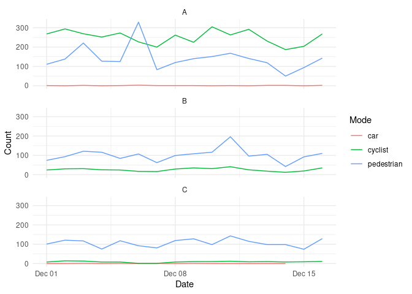
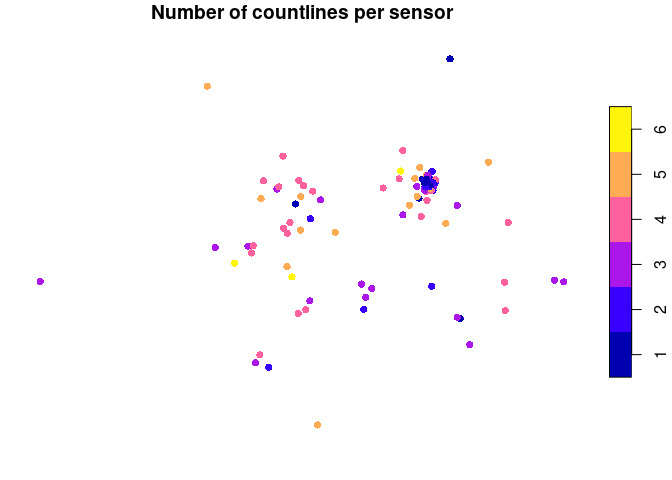

<!-- README.md is generated from README.Rmd. Please edit that file -->

# vivrcity

<!-- badges: start -->

<!-- badges: end -->

The goal of vivrcity is to provide a simple R interface to the [Vivacity
Labs API](https://docs.vivacitylabs.com/).

## Installation

You can install the development version of vivrcity from
[GitHub](https://github.com/) with:

``` r
# install.packages("devtools")
devtools::install_github("Robinlovelace/vivrcity")
```

## Setup

You need a Vivacity API key to use this package. Save it in your
`.Renviron` file:

    VIVACITY_API_KEY=your_api_key_here

## Installation

This example demonstrates how to retrieve metadata, counts, and
visualize traffic data.

Load the package:

``` r
library(vivrcity)
```

<details>

<summary>

Development
</summary>

Or for developing, clone the repo with the following command:

``` sh
gh repo clone Robinlovelace/vivrcity
```

See [GitHub CLI installation
instructions](https://github.com/cli/cli#installation) for how to
install `gh`.

And then open the folder in RStudio/VSCode/your favourite IDE and run:

``` r
devtools::load_all()
#> ℹ Loading vivrcity
```

</details>

## Countline metadata

``` r
library(dplyr)
library(ggplot2)

# Get countline metadata (returns sf object)
metadata_sf <- get_countline_metadata()
names(metadata_sf)
#>  [1] "id"                                 "name"                              
#>  [3] "sensor_name"                        "description"                       
#>  [5] "direction"                          "is_dwell_times_filtering_countline"
#>  [7] "is_anpr"                            "is_speed"                          
#>  [9] "modified_at"                        "geometry"
```

The countline dataset is represented as linestrings. For visualisation
it can be useful to convert to points:

``` r
metadata_points <- metadata_sf |>
  sf::st_centroid()
#> Warning: st_centroid assumes attributes are constant over geometries
```

You can then visualise the data with your favourite mapping package,
e.g.:

``` r
library(tmap)
tmap_mode("view")
qtm(metadata_points)
```

Note that each device typically has 2 countlines (e.g. `S38_in` and
`S38_out`):

``` r
metadata_sf$id |>
  duplicated() |>
  summary()
#>    Mode   FALSE 
#> logical     434
# for name:
metadata_sf$name |>
  duplicated() |>
  summary()
#>    Mode   FALSE    TRUE 
#> logical     430       4
# simplified name:
metadata_sf$sensor_name |>
  duplicated() |>
  summary()
#>    Mode   FALSE    TRUE 
#> logical     164     270
```

## Getting counts

``` r
# Sample 3 random countlines and rename to A, B, C
set.seed(2025)
sampled_metadata <- metadata_sf |>
  slice_sample(n = 3) |>
  mutate(sensor = c("A", "B", "C"))
sampled_ids <- sampled_metadata$id
id_lookup <- setNames(sampled_metadata$sensor, sampled_metadata$id)

# Get counts for a week in 2025
from_time <- as.POSIXct("2025-12-01", tz = "UTC")
to_time <- as.POSIXct("2025-12-17", tz = "UTC")

# Get counts by mode/class (default with get_counts)
counts <- get_counts(sampled_ids, from = from_time, to = to_time)

names(counts)
#> [1] "id"          "sensor_name" "name"        "from"        "to"         
#> [6] "direction"   "class"       "count"

# Plot pedestrians vs cyclists
counts |>
  filter(class %in% c("pedestrian", "cyclist", "car")) |>
  mutate(sensor = id_lookup[id]) |>
  group_by(sensor, class, day = as.Date(from)) |>
  summarise(count = sum(count, na.rm = TRUE), .groups = "drop") |>
  ggplot(aes(x = day, y = count, color = class)) +
  geom_line() +
  facet_wrap(~sensor, ncol = 1) +
  labs(
    x = "Date",
    y = "Count",
    color = "Mode"
  ) +
  theme_minimal()
```



## Getting speeds

Note: this will fail if the sensors don’t have speed recording enabled:

``` r
# Get speeds (function accepts vector of IDs)
speeds_df <- get_countline_speed(sampled_ids, from = from_time, to = to_time)
```

## Aggregating data

Sometimes you might want to aggregate data from multiple countlines that
belong to the same sensor (e.g. `S38_in` and `S38_out`). The package
provides functions to simplify IDs and aggregate both counts and
metadata.

``` r
# Aggregate counts (sums across directions for same ID)
aggregated_counts <- aggregate_counts(counts)
nrow(aggregated_counts) / nrow(counts)
#> [1] 0.5

# Aggregate metadata (returns sf object with one row per sensor)
metadata_aggregated <- aggregate_metadata(metadata_sf)
#> Warning: st_centroid assumes attributes are constant over geometries
names(metadata_aggregated)
#> [1] "id"           "ids"          "names"        "n_countlines" "geometry"
nrow(metadata_sf)
#> [1] 434
nrow(metadata_aggregated)
#> [1] 162

# Plot aggregated metadata
plot(metadata_aggregated["n_countlines"], main = "Number of countlines per sensor", pch = 16)
```



## Next Steps

This package currently implements a subset of the [Vivacity Traffic
Monitoring API](https://docs.vivacitylabs.com/). Future development
could include:

**Additional Countline Endpoints:** - Journey times
(`/countline/journey_times`) - requires ANPR-enabled sensors

**Zone-Based Data:** - Zonal speeds (`/zone/speeds`) - Occupancy data
(`/zone/occupancy`)  
- Turning movements (`/zone/turning_movements`) - Dwell times
(`/zone/dwell_times`)

**Other Features:** - Viewpoint metadata and data availability - Zone
metadata - Annotations support - V2 API endpoints for projects and
positions

**Improvements:** - Better error handling with informative messages -
Automatic pagination for large queries - Caching of metadata requests -
Support for all vehicle/pedestrian class types

Contributions welcome! See the [API
documentation](https://docs.vivacitylabs.com/) for endpoint details.
